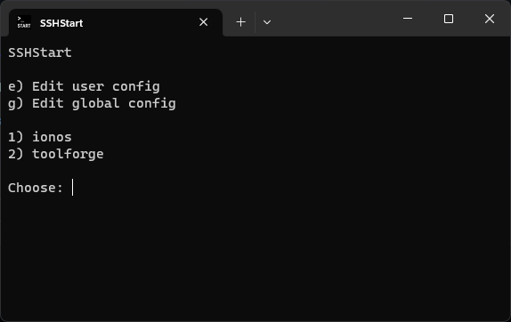

# SSHStart - Secure Shell Start

SSHStart allows you to easily view, edit, and launch your saved SSH hosts. With it you can list and choose a SSH host to enter and view/edit your system-wide and user-specific SSH host.

## Integrations

The installer offers integration into the Windows Terminal and the system path. The installer also defines the alias `sshs`, making it easier to launch SSHStart from a terminal.

## Building

SSHStart is built with Visual Studio, which offers the easiest way to build SSHStart. The installer is built from `install.iss` with Inno Setup.

## Screenshot

